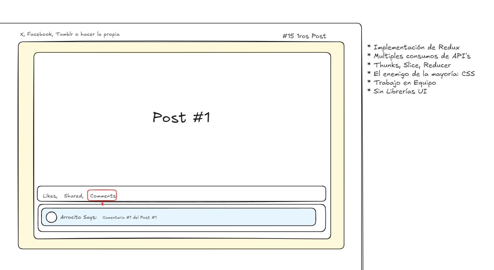
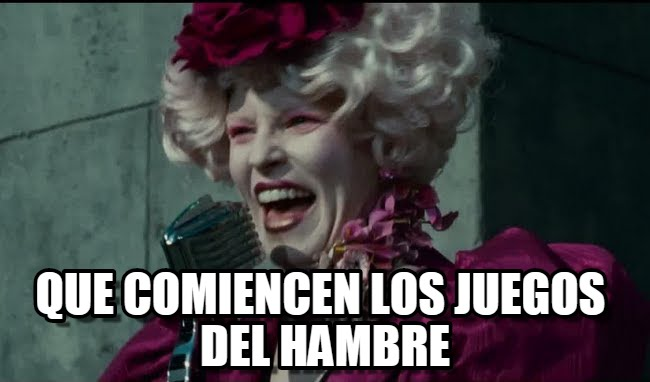

# Taller #5 - Uso de Redux

## Clases SENA

 

  

## Objetivo de la Actividad

- Los equipos deberan considerar sus fortalezas y debilidades para lograr el objetivo en el tiempo estimado.
- Por ahora veremos como nos desempeñamos así y con el paso de las clases veremos como mejorar usando herramientas de trabajo en Equipo y profundizaremos en SCRUM.
- Afianzar los conocimientos de la clase usando Redux.
- Recordemos, ¡La comunicación es la base de todo!

## Contexto

Un magnate de las IT's contacto al SENA para contratar a sus **mejores desarrolladoras** y montar la próxima competencia de alguna **Plataforma de microblogging y red social** como es _X, Tumblr, Plurk, CoHost, etc_. Nuestro deber será trabajar en equipo para crear una aplicación web que permita a los usuarios poder ver los posts de otros usuarios y sus comentarios por defecto.

## Requisitos para nuestro MVP (Producto Minimo Viable)

- **Trabajo en Equipo** (Quiero ver Commits en ese Repo de cada persona integrante del Equipo).
- Implementación de Redux.
- Multiples consumos de API's.
  - API de Posts
  - API de Comentarios
- Implementar Thunks, Slice y Reducers.
- El enemigo del mundo: CSS.
- **Sin Librerías UI (Para mejorar nuestras habilidades de Maquetadores)**.

## Consideraciones

- El diseño puede ser copiado o inventado de algún lado.
- Uso de componentes.
- Los Likes y Compartidos deben ser un valor aleatorio.
- Inicialmente solo se veran los 1ros 15 post's.
- **Se pueden usar librerías de Estilos como Bulma, CSS, Tailwind, etc.**

## Recursos

### API's

- [API de Posts y Comentarios](https://jsonplaceholder.typicode.com/)

### Iconos

- [Iconos Assets](https://www.flaticon.com/es/search?word=like&style=flat)
- [Iconos Componentes](https://react-icons.github.io/react-icons/)

### Redux

- [Redux](https://redux.js.org/)
- [Redux Thunk](https://github.com/reduxjs/redux-thunk)

## Retos Adicionales si vamos sobrados (Plus de Nota)

- Que se pueda añadir nuevos comentarios a nuestro estado local (Incluso guardarlos en el localStorage para que siempre se vean).
- Que se añadan nuevos posts a la vista cuando haga scroll y se llegue a la parte inferior de la página.

 

---

¡Gracias por formar parte de la iniciativa de **Mujeres Digitales**!

  

