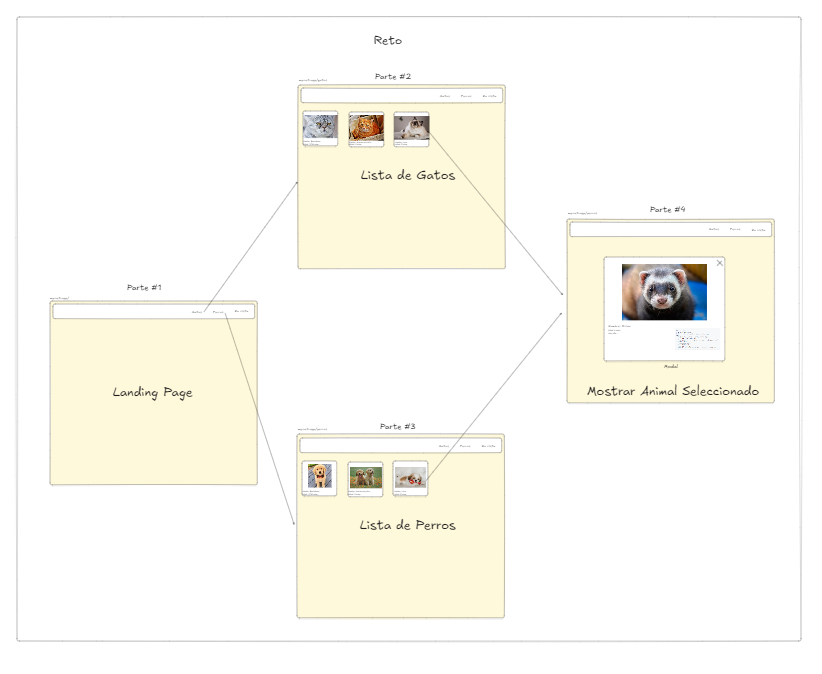
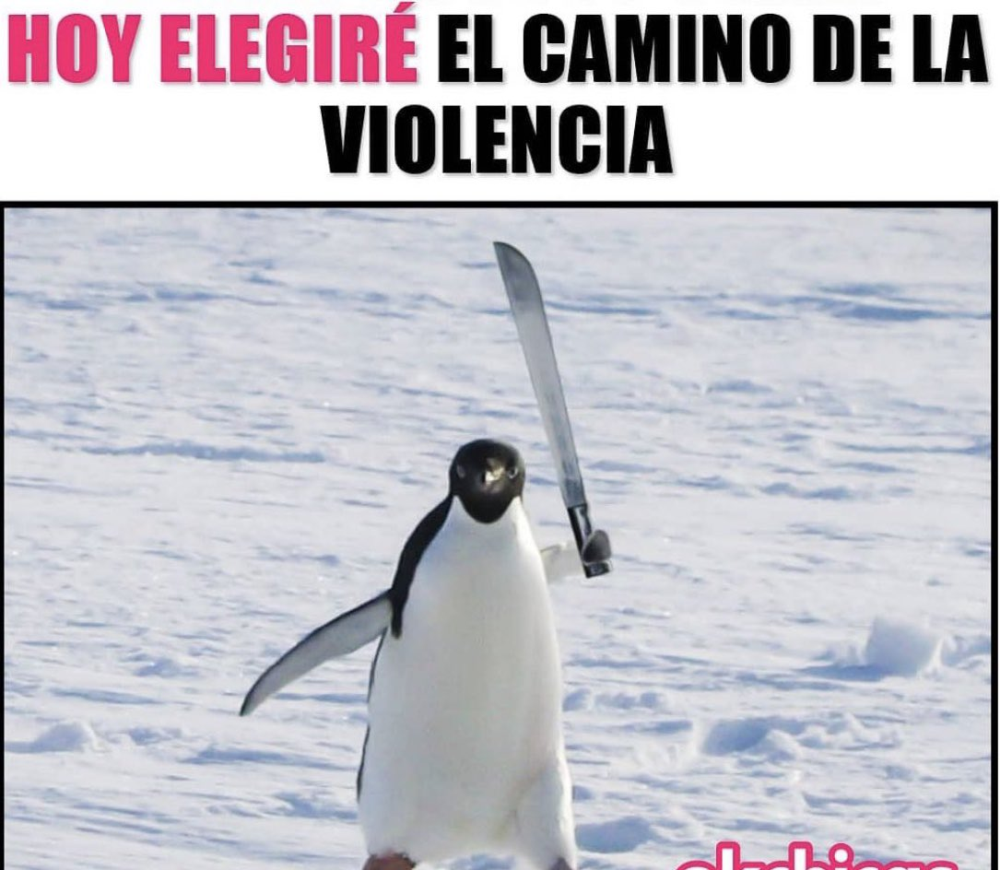

# Taller #6 - Router, State & Styles

## Clases SENA

 

  

## Objetivo de la Actividad

- Los equipos deberan considerar sus fortalezas y debilidades para lograr el objetivo en el tiempo estimado.
- Vamos a afianzar nuestros conocimientos de trabajo en equipo, SCRUM y Git Trunks.
- Llevaremos a un paso más allá el termino de SPA, usando Router's, Context API, CSS, Responsive y el manejo de estados complejos.
- Recordemos, ¡La comunicación es la base de todo!

## Contexto

Una organización sin fines de lucro, enfocada en la protección animal, ha contactado a un equipo de desarrolladores para crear una plataforma que ayude a fomentar la adopción de perros y gatos en refugios locales. Contacto al SENA para contratar a sus **mejores desarrolladoras** para crear un producto que satisfaga las necesidades de la organización.

El objetivo principal es construir una Landing Page que permita a los usuarios ver imágenes y datos de los animales, como su raza, edad y tamaño, utilizando las APIs **DogAPI** y **CatAPI**.

## Requisitos para nuestro MVP (Producto Minimo Viable)

- **Trabajo en Equipo** (Quiero ver Commits en ese Repo de cada persona integrante del Equipo).
- Implementación de algún manejador de Estados Complejos (Redux, Zustand, MobX, etc.).
- Implementación de un Router.
- Multiples consumos de API's.
  - API de Cats
  - API de Dogs
- El enemigo del mundo: CSS.
- **Sin Librerías UI (Para mejorar nuestras habilidades de Maquetadores)**.
- Ver los datos del animal seleccionado en una ventana emergente.

## Consideraciones

- El diseño puede ser copiado o inventado de algún lado.
- Uso de componentes reutilizables, les va a salvar la vida.
- **Se pueden usar librerías de Estilos como Bulma, CSS, Tailwind, etc.**

## Recursos

### API's

- [TheCat API](https://thecatapi.com/)
- [TheDog API](https://thedogapi.com/)

### Iconos

- [Iconos Assets](https://www.flaticon.com/es/search?word=like&style=flat)
- [Iconos Componentes](https://react-icons.github.io/react-icons/)

### Redux

- [Redux](https://redux.js.org/)
- [Redux Thunk](https://github.com/reduxjs/redux-thunk)
- [Zustand](https://zustand-demo.pmnd.rs/)
- [Jotai](https://jotai.org/)

### Ejemplo

- [Landing Page](https://co.pinterest.com/pin/203436108163035571/)

## Retos Adicionales si vamos sobrados (Plus de Nota)

- Ventana que permita cuales animales quiero adoptar o me interesa adoptar.
- Poder compartir un enlace de un animal con otros usuarios.
- Guardar la información en el LocalStorage para persistencia de datos.

 

---

¡Gracias por formar parte de la iniciativa de **Mujeres Digitales**!

  

